# RAPS

**R**equirements · **A**rchitecture · **P**roduction · **S**hipping

A structured methodology that transforms AI-assisted development from unpredictable experimentation into a **governed, auditable process** with clear accountability at every step.

---

## What is RAPS?

RAPS is a **structured methodology** for managing AI-powered software development. Think of it as bringing the discipline of manufacturing assembly lines to the world of AI coding assistants.

### The Problem RAPS Solves

When developers use AI assistants without structure, common issues arise:
- **No paper trail** — Changes happen with no record of *why*
- **Quality inconsistency** — Some outputs are excellent, others are buggy
- **Scope drift** — The AI starts "helping" in areas it shouldn't touch  
- **Security blind spots** — Vulnerabilities slip through unnoticed

RAPS addresses each of these by introducing **specialized roles**, **mandatory checkpoints**, and **complete audit trails**.

---

## The Development Journey

```mermaid
%%{init: {'theme': 'neutral', 'themeVariables': { 'primaryColor': '#e8eef4', 'primaryTextColor': '#2c3e50', 'primaryBorderColor': '#bdc3c7', 'lineColor': '#7f8c8d', 'secondaryColor': '#f5f6fa', 'tertiaryColor': '#fff'}}}%%
flowchart TD
    subgraph PLAN ["📋 PLAN"]
        A[Requirements] --> B[Architecture]
    end
    
    subgraph BUILD ["🔨 BUILD"]
        C[Development] --> D[Design]
    end
    
    subgraph VERIFY ["✓ VERIFY"]
        E[Testing] --> F[Security]
    end
    
    subgraph SHIP ["🚀 SHIP"]
        G[Deploy]
    end
    
    PLAN --> BUILD --> VERIFY --> SHIP
```



---

## Phase 1: Planning

Before any code is written, RAPS ensures the *right* thing gets built.

### Requirements Analysis

The `/analyst` persona conducts a structured dialogue to extract requirements — asking clarifying questions, identifying edge cases, and documenting assumptions. Vague requests become specific, testable statements.

**Before:** *"Users should have a good login experience"*

**After:** *"Users can log in within 3 seconds. Invalid credentials show a clear error message. After 5 failed attempts, the account locks for 15 minutes with an explanation."*

Every requirement is written so it can be verified. If you can't test it, it's not a requirement — it's a wish. The output is a set of user stories that anyone on the team can read, understand, and check off when complete.

**Output:** `FRD_USER_STORIES.md` containing all stories with acceptance criteria.

### Architecture Design

Technical specifications are created using a structured approach:

1. **System Design Document (SDD)** — High-level architecture, component diagrams, data flow
2. **API Contracts** — OpenAPI/Swagger specs defining every endpoint
3. **Data Models** — Entity-relationship diagrams, schema definitions
4. **Sequence Diagrams** — Step-by-step flow for complex operations

The `/architect` persona produces these artifacts by:
- Analyzing requirements from `/analyst`
- Researching similar implementations
- Documenting trade-offs between approaches
- Generating Mermaid diagrams for visualization

**Output:** `SPECS.md`, `SDD.md`, API schemas, ERD diagrams.

### Decision Documentation

Every significant choice is recorded as an **Architecture Decision Record (ADR)**:

```markdown
# ADR-001: Use PostgreSQL over MongoDB

## Status
Accepted

## Context
We need a database for user data and transactions. 
Options considered: PostgreSQL, MongoDB, MySQL.

## Decision
PostgreSQL for ACID compliance and complex queries.

## Consequences
- ✅ Strong data integrity for financial transactions
- ✅ Mature tooling and community support
- ⚠️ Requires schema migrations for changes
```

ADRs are stored in `/docs/decisions/` and linked from `DECISION_LOG.md`.

---

## Phase 2: Building

Development happens in parallel tracks with clear boundaries.

### Backend Development

The `/build` persona implements server-side logic:

- **API Endpoints** — RESTful routes following OpenAPI specs from Architect
- **Business Logic** — Core algorithms, validation rules, calculations
- **Database Layer** — Migrations, queries, connection pooling
- **Integrations** — Third-party APIs, webhooks, message queues

Code follows the specification exactly. If the spec is unclear, `/build` escalates to `/architect` rather than guessing.

**Output:** Working backend code in `/backend/`, `/api/`, `/lib/`.

### Frontend Design

The `/design` persona implements the visual layer:

- **UI Components** — Reusable React/Vue/Svelte components
- **Styling** — CSS, design tokens, responsive layouts
- **Interactions** — Animations, form handling, state management
- **Assets** — Icons, images, fonts

The designer works from wireframes and specs, not imagination. If designs are missing, `/design` requests them from `/analyst` or `/architect`.

**Output:** Frontend code in `/frontend/`, `/components/`, `/style/`.

### Code Review (Optional)

The `/review` persona validates code before testing:

| Check | What It Catches |
|:------|:----------------|
| Security basics | Hardcoded secrets, SQL injection patterns |
| Code quality | Missing docstrings, unclear naming |
| Pattern compliance | Deviations from architecture |
| Error handling | Missing try/catch, silent failures |

**Output:** Approval or change requests in `HANDOFF_NOTES.md`.

---

## Phase 3: Verification

Nothing ships without validation.

### Automated Testing

The `/test` persona runs comprehensive test suites:

- **Unit Tests** — Individual functions in isolation
- **Integration Tests** — Components working together
- **End-to-End Tests** — Full user flows via browser automation
- **Performance Tests** — Load testing, response times

Tests are written against acceptance criteria from requirements. A story isn't "done" until its tests pass.

**Output:** Test reports, coverage metrics in `/tests/COVERAGE_*.md`.

### Security Auditing

The `/security` persona scans for vulnerabilities:

- **OWASP Top 10** — SQL injection, XSS, CSRF, etc.
- **Dependency Audit** — Known CVEs in npm/pip packages
- **Secret Detection** — API keys, passwords in code
- **Auth Review** — Session handling, permission checks

Critical findings block release. Medium/low issues are documented for future sprints.

**Output:** Security audit report in `/docs/security/`.

### User Acceptance

The `/ux` persona validates real-world usability:

- **Task Completion** — Can users achieve their goals?
- **Error Recovery** — What happens when things go wrong?
- **Accessibility** — Screen readers, keyboard navigation
- **Performance Feel** — Perceived speed, responsiveness

Issues are categorized by severity:

| Severity | Definition | Action |
|:---------|:-----------|:-------|
| 🔴 Critical | User cannot complete core task | Fix before release |
| 🟡 Medium | Friction but workaround exists | Ship with known issues |
| 🟢 Low | Cosmetic, nice-to-have | Backlog for v1.1 |

**Output:** UAT report in `/docs/ux_feedback/`.

---

## Phase 4: Shipping

Deployment follows a controlled process.

### Staging First

All changes deploy to staging before production. This catches environment-specific issues (config, secrets, scaling).

### Rollback Ready

Every deployment includes:
- Previous version tagged and preserved
- One-command rollback procedure
- Health checks that trigger automatic rollback on failure

### Monitoring Active

Post-deployment visibility:
- Error rate dashboards
- Performance metrics
- User behavior analytics
- Alerting for anomalies

---

## The Specialist Team

RAPS deploys **specialized personas**, each with deep expertise in their domain.

| Persona | Command | Responsibility | File Access |
|:--------|:--------|:---------------|:------------|
| **Analyst** | `/analyst` | Gathers requirements, writes user stories, researches solutions | `/docs/product/`, `/docs/functional/` |
| **Architect** | `/architect` | Creates technical specifications, makes design decisions | `/docs/technical/`, `/docs/decisions/` |
| **Builder** | `/build` | Writes backend code, APIs, database logic | `/backend/`, `/api/`, `/lib/` |
| **Designer** | `/design` | Builds UI components, styling, frontend code | `/frontend/`, `/components/`, `/style/` |
| **Reviewer** | `/review` | Checks code quality, patterns, security basics | Read-only on changed files |
| **Tester** | `/test` | Runs tests, reports bugs, validates behavior | `/tests/`, `/e2e/` |
| **UX Advocate** | `/ux` | Validates usability, accessibility, user acceptance | `/docs/ux_feedback/` |
| **Security Auditor** | `/security` | Scans vulnerabilities, checks compliance | `/docs/security/` |
| **DevOps** | `/deploy` | Manages infrastructure, CI/CD, monitoring | `/infrastructure/`, `/docker/` |

---

## Lane Discipline: How It Works

Each persona can only modify files in their designated "lane." This is enforced at the system level:

### The Mechanism

When a persona attempts to modify a file:

1. **Path Check** — The system compares the file path against the persona's allowed directories
2. **Block or Allow** — If the path isn't in the allow-list, the modification is rejected
3. **Audit Log** — Both allowed and blocked attempts are logged

### What This Prevents

| Scenario | Without Lanes | With Lanes |
|:---------|:--------------|:-----------|
| Designer adds "quick fix" to API | Backend breaks in production | Modification blocked, escalated to `/build` |
| Builder "improves" button styling | UI inconsistency, design debt | Modification blocked, escalated to `/design` |
| Any persona edits `.env` | Secrets exposed or corrupted | Modification blocked, requires `/security` review |

### Why It Matters

AI assistants are helpful but lack context about organizational boundaries. A model trained on full-stack code will happily modify any file you show it. Lane discipline adds the guardrails that human developers learn through experience.

---

## Governance & Accountability

### The Release Gates

Before any version ships, it must pass through six mandatory checkpoints:


| Gate | Owner | Question Answered |
|:-----|:------|:------------------|
| Feature Complete | `/architect` | Are all requirements implemented? |
| Code Complete | `/build` | Does it build without errors? |
| Tests Pass | `/test` | Are there critical bugs? |
| Security Clear | `/security` | Are there vulnerabilities? |
| UAT Approved | `/ux` | Do users accept it? |
| Go-Live | `/deploy` | Is deployment successful? |

**No shortcuts.** If a gate fails, work returns to the appropriate phase for fixes.

### The Audit Trail

Every action taken by any persona is logged to `SESSION_LOG.md`:

| Timestamp | Persona | Action | Status | Files Changed |
|:----------|:--------|:-------|:-------|:--------------|
| 2026-01-23 14:30 | /build | Created auth API | ✅ Done | `/backend/auth.ts` |
| 2026-01-23 15:45 | /test | Ran unit tests | ❌ Failed | — |
| 2026-01-23 16:00 | /build | Fixed auth bug | ✅ Done | `/backend/auth.ts` |

This provides **complete traceability** — you can always answer "what changed, when, and why."

### The Master Ledger

`PLAN.md` serves as the **single source of truth** for project state:

- **Squad Status** — Which persona is active, which are idle
- **Task Backlog** — All pending work, prioritized
- **Sprint Tracking** — Current sprint goals and progress
- **Artifact Registry** — All generated documents and specs

---

## Key Artifacts

RAPS generates and maintains several structured documents:

| Artifact | Purpose |
|:---------|:--------|
| `PLAN.md` | Master ledger — project state, backlog, status |
| `CHARTER.md` | Project scope, vision, risk register |
| `SESSION_LOG.md` | Complete audit trail of all actions |
| `HANDOFF_NOTES.md` | Context passed between personas |
| `SPECS.md` | Technical specifications from Architect |
| `ADR-###.md` | Architecture Decision Records |

---

## Real-Time Visibility

The RAPS Dashboard provides an executive view of project health:

- **Current Focus** — Which specialist is working, on what task
- **Project Health** — Overall status indicator
- **Task Board** — Kanban view of work in progress
- **Recent Activity** — Latest logged actions

```bash
cd dashboard
npm install && npm run dev
```

---

## Getting Started

### Initialize a New Project
```bash
/initialize
```
Creates folder structure, `PLAN.md`, and tracking files.

### Check Status Anytime
```bash
/raps-status
```
Shows current persona, active task, blockers, and next steps.

### Follow the Flow
```bash
/analyst     # Define requirements
/architect   # Write specifications  
/build       # Implement backend
/design      # Build frontend
/test        # Verify quality
/deploy      # Ship to production
```

---

## Addressing AI Skepticism

Common concerns about AI-assisted development — and how RAPS handles them:

### "AI hallucinates and makes things up"

**RAPS answer:** Every AI action is logged in `SESSION_LOG.md` with timestamps. The `/architect` persona must produce specifications *before* code is written, and `/test` verifies output against those specs. Hallucinations get caught at multiple checkpoints.

### "AI doesn't understand our business context"

**RAPS answer:** The `/analyst` persona's sole job is gathering requirements and translating business needs into structured user stories. These are documented in `HANDOFF_NOTES.md` and passed to downstream personas. Context isn't assumed — it's explicitly captured.

### "AI will introduce security vulnerabilities"

**RAPS answer:** The `/security` persona runs dedicated vulnerability scans before any release. No code ships without passing the Security Gate. Lane discipline also prevents unauthorized access to sensitive files like `.env` or auth modules.

### "We can't trust AI with production systems"

**RAPS answer:** The `/deploy` persona follows strict protocols: staging first, rollback ready, monitoring active. The Release Gates require `/test`, `/security`, and `/ux` approval before deployment is even possible.

### "AI changes break things we didn't expect"

**RAPS answer:** Lane discipline restricts each persona to specific directories. The system checks every file modification against an allow-list. A `/design` persona literally *cannot* modify `/backend/` files — the system blocks the attempt and logs it. Unexpected side effects are structurally impossible.

### "There's no accountability when AI makes mistakes"

**RAPS answer:** Every action is attributed to a specific persona with timestamps. `PLAN.md` tracks task ownership. When something breaks, the audit trail shows exactly what happened, when, and which persona was responsible.

### "AI just generates spaghetti code"

**RAPS answer:** The `/architect` persona produces technical specifications before implementation. The optional `/review` step checks code quality, patterns, and maintainability. Code is written to spec, not improvised.

---

*RAPS v4 — Industrial-grade governance for the AI development era.*
