# 🎯 RAPS: AI Development, Engineered

> **R**equirements · **A**rchitecture · **P**roduction · **S**hipping

RAPS transforms AI-assisted development from unpredictable experimentation into a **governed, auditable process** with clear accountability at every step.

---

## What is RAPS?

RAPS is a **structured methodology** for managing AI-powered software development. Think of it as bringing the discipline of manufacturing assembly lines to the world of AI coding assistants.

### The Problem RAPS Solves

When developers use AI assistants without structure, common issues arise:
- **No paper trail** — Changes happen with no record of *why*
- **Quality inconsistency** — Some outputs are excellent, others are buggy
- **Scope drift** — The AI starts "helping" in areas it shouldn't touch  
- **Security blind spots** — Vulnerabilities slip through unnoticed

RAPS addresses each of these by introducing **specialized roles**, **mandatory checkpoints**, and **complete audit trails**.

---

## The Development Journey

```mermaid
%%{init: {'theme': 'neutral', 'themeVariables': { 'primaryColor': '#e8eef4', 'primaryTextColor': '#2c3e50', 'primaryBorderColor': '#bdc3c7', 'lineColor': '#7f8c8d', 'secondaryColor': '#f5f6fa', 'tertiaryColor': '#fff'}}}%%
flowchart TD
    subgraph PLAN ["📋 PLAN"]
        A[Requirements] --> B[Architecture]
    end
    
    subgraph BUILD ["🔨 BUILD"]
        C[Development] --> D[Design]
    end
    
    subgraph VERIFY ["✓ VERIFY"]
        E[Testing] --> F[Security]
    end
    
    subgraph SHIP ["🚀 SHIP"]
        G[Deploy]
    end
    
    PLAN --> BUILD --> VERIFY --> SHIP
```



### Phase 1: Planning

Before any code is written, RAPS ensures the *right* thing gets built:

- **Requirements Analysis** — Business needs are translated into clear, testable user stories
- **Architecture Design** — Technical specifications are created, reviewed, and approved
- **Decision Documentation** — Every significant choice is recorded with rationale

### Phase 2: Building

Development happens in parallel tracks with clear boundaries:

- **Backend Development** — APIs, business logic, database schemas
- **Frontend Design** — User interfaces, interactions, visual polish
- **Code Review** — Optional quality checkpoint before testing

### Phase 3: Verification

Nothing ships without validation:

- **Automated Testing** — Unit tests, integration tests, end-to-end tests
- **Security Auditing** — Vulnerability scanning, dependency checks, secret detection
- **User Acceptance** — Real-world usability validation

### Phase 4: Shipping

Deployment follows a controlled process:

- **Staging First** — Changes proven in a safe environment
- **Rollback Ready** — Every deployment can be reversed
- **Monitoring Active** — Issues detected immediately

---

## The Specialist Team

RAPS doesn't use a single AI for everything. Instead, it deploys **specialized personas**, each with deep expertise in their domain.

| Persona | Command | Responsibility | File Access |
|:--------|:--------|:---------------|:------------|
| **Analyst** | `/analyst` | Gathers requirements, writes user stories, researches solutions | `/docs/product/`, `/docs/functional/` |
| **Architect** | `/architect` | Creates technical specifications, makes design decisions | `/docs/technical/`, `/docs/decisions/` |
| **Builder** | `/build` | Writes backend code, APIs, database logic | `/backend/`, `/api/`, `/lib/` |
| **Designer** | `/design` | Builds UI components, styling, frontend code | `/frontend/`, `/components/`, `/style/` |
| **Reviewer** | `/review` | Checks code quality, patterns, security basics | Read-only on changed files |
| **Tester** | `/test` | Runs tests, reports bugs, validates behavior | `/tests/`, `/e2e/` |
| **UX Advocate** | `/ux` | Validates usability, accessibility, user acceptance | `/docs/ux_feedback/` |
| **Security Auditor** | `/security` | Scans vulnerabilities, checks compliance | `/docs/security/` |
| **DevOps** | `/deploy` | Manages infrastructure, CI/CD, monitoring | `/infrastructure/`, `/docker/` |

### Lane Discipline

Each persona can only modify files in their designated "lane." This prevents:
- A designer accidentally breaking backend logic
- A builder making unauthorized architecture changes
- Any persona touching security-sensitive files without proper review

---

## Governance & Accountability

### The Release Gates

Before any version ships, it must pass through six mandatory checkpoints:

```mermaid
%%{init: {'theme': 'neutral'}}%%
flowchart TB
    G1["🎯 Feature Complete<br/><small>All requirements implemented</small>"]
    G2["💻 Code Complete<br/><small>No build errors, deps locked</small>"]
    G3["🧪 Tests Pass<br/><small>No critical/high bugs</small>"]
    G4["🔒 Security Clear<br/><small>No vulnerabilities</small>"]
    G5["👤 UAT Approved<br/><small>Users accept the release</small>"]
    G6["🚀 Go-Live<br/><small>Deployment confirmed</small>"]
    
    G1 --> G2 --> G3 --> G4 --> G5 --> G6
```



**No shortcuts.** If a gate fails, work returns to the appropriate phase for fixes.

### The Audit Trail

Every action taken by any persona is logged to `SESSION_LOG.md`:

| Timestamp | Persona | Action | Status | Files Changed |
|:----------|:--------|:-------|:-------|:--------------|
| 2026-01-23 14:30 | /build | Created auth API | ✅ Done | `/backend/auth.ts` |
| 2026-01-23 15:45 | /test | Ran unit tests | ❌ Failed | — |
| 2026-01-23 16:00 | /build | Fixed auth bug | ✅ Done | `/backend/auth.ts` |

This provides **complete traceability** — you can always answer "what changed, when, and why."

### The Master Ledger

`PLAN.md` serves as the **single source of truth** for project state:

- **Squad Status** — Which persona is active, which are idle
- **Task Backlog** — All pending work, prioritized
- **Sprint Tracking** — Current sprint goals and progress
- **Artifact Registry** — All generated documents and specs

---

## Key Artifacts

RAPS generates and maintains several structured documents:

| Artifact | Purpose |
|:---------|:--------|
| `PLAN.md` | Master ledger — project state, backlog, status |
| `CHARTER.md` | Project scope, vision, risk register |
| `SESSION_LOG.md` | Complete audit trail of all actions |
| `HANDOFF_NOTES.md` | Context passed between personas |
| `SPECS.md` | Technical specifications from Architect |
| `ADR-###.md` | Architecture Decision Records |

---

## Real-Time Visibility

The RAPS Dashboard provides an executive view of project health:

- **Current Focus** — Which specialist is working, on what task
- **Project Health** — Overall status indicator
- **Task Board** — Kanban view of work in progress
- **Recent Activity** — Latest logged actions

```bash
cd dashboard
npm install && npm run dev
```

---

## Getting Started

### Initialize a New Project
```bash
/initialize
```
Creates folder structure, `PLAN.md`, and tracking files.

### Check Status Anytime
```bash
/raps-status
```
Shows current persona, active task, blockers, and next steps.

### Follow the Flow
```bash
/analyst     # Define requirements
/architect   # Write specifications  
/build       # Implement backend
/design      # Build frontend
/test        # Verify quality
/deploy      # Ship to production
```

---

## Addressing AI Skepticism

Common concerns about AI-assisted development — and how RAPS handles them:

### "AI hallucinates and makes things up"

**RAPS answer:** Every AI action is logged in `SESSION_LOG.md` with timestamps. The `/architect` persona must produce specifications *before* code is written, and `/test` verifies output against those specs. Hallucinations get caught at multiple checkpoints.

### "AI doesn't understand our business context"

**RAPS answer:** The `/analyst` persona's sole job is gathering requirements and translating business needs into structured user stories. These are documented in `HANDOFF_NOTES.md` and passed to downstream personas. Context isn't assumed — it's explicitly captured.

### "AI will introduce security vulnerabilities"

**RAPS answer:** The `/security` persona runs dedicated vulnerability scans before any release. No code ships without passing the Security Gate. Lane discipline also prevents unauthorized access to sensitive files like `.env` or auth modules.

### "We can't trust AI with production systems"

**RAPS answer:** The `/deploy` persona follows strict protocols: staging first, rollback ready, monitoring active. The Release Gates require `/test`, `/security`, and `/ux` approval before deployment is even possible.

### "AI changes break things we didn't expect"

**RAPS answer:** Lane discipline restricts each persona to specific directories. A `/design` persona cannot touch backend code. A `/build` persona cannot modify UI components. Unexpected side effects are structurally prevented.

### "There's no accountability when AI makes mistakes"

**RAPS answer:** Every action is attributed to a specific persona with timestamps. `PLAN.md` tracks task ownership. When something breaks, the audit trail shows exactly what happened, when, and which persona was responsible.

### "AI just generates spaghetti code"

**RAPS answer:** The `/architect` persona produces technical specifications before implementation. The optional `/review` step checks code quality, patterns, and maintainability. Code is written to spec, not improvised.

---

*RAPS v4 — Industrial-grade governance for the AI development era.*
