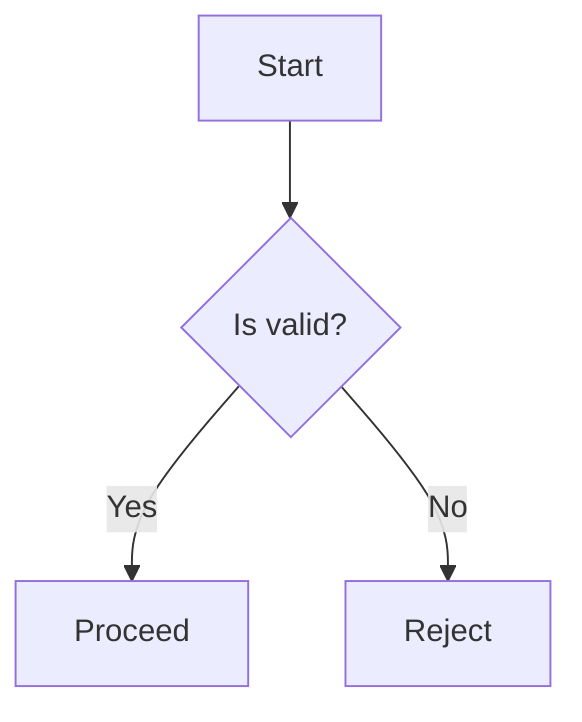
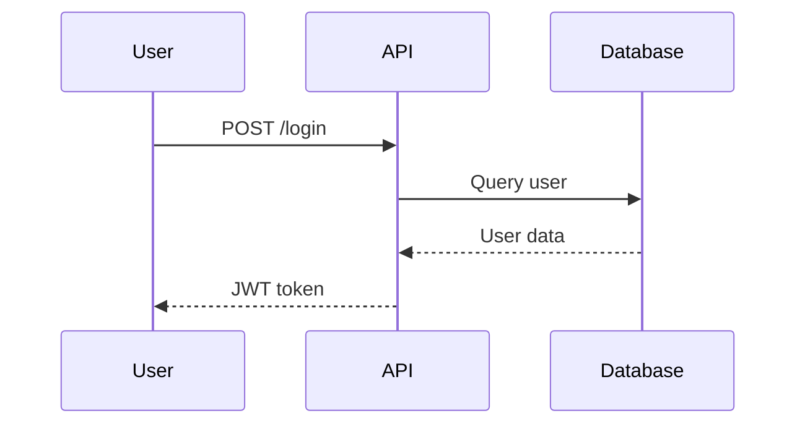
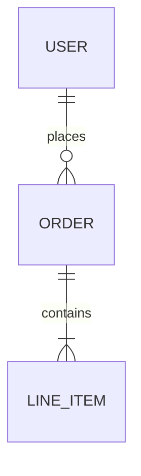
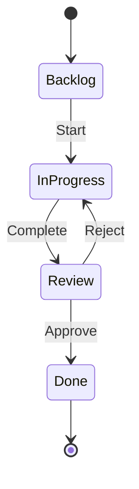

# 📊 RAPS Diagram Standards

Guidelines for creating consistent, readable diagrams across RAPS documentation.

---

## 1. Mermaid Syntax Standards

### Quoting Rules
Always quote labels containing special characters:
```mermaid
%% CORRECT
graph TD
    A["Label (with parens)"]
    B["Label [with brackets]"]

%% INCORRECT - will break
graph TD
    A[Label (with parens)]
```

### Node Naming
- Use UPPERCASE for node IDs: `A`, `B`, `START`, `END`
- Use descriptive IDs for complex diagrams: `AUTH`, `DB`, `API`

---

## 2. Diagram Types by Use Case

| Type | Use For | Mermaid Keyword |
|------|---------|-----------------|
| **Flowchart** | Process flows, decision trees | `flowchart TD` |
| **Sequence** | API calls, interactions | `sequenceDiagram` |
| **ERD** | Database relationships | `erDiagram` |
| **State** | Lifecycle, status transitions | `stateDiagram-v2` |
| **Gantt** | Timelines, sprints | `gantt` |

---

## 3. Flowchart Standards

### Direction
- `TD` (top-down) for hierarchical flows
- `LR` (left-right) for sequential processes

### Example: Decision Tree


---

## 4. Sequence Diagram Standards

### Participants
- Declare in order of appearance
- Use short aliases

### Example: API Flow


---

## 5. ERD Standards

### Relationship Symbols
| Symbol | Meaning |
|--------|---------|
| `\|\|` | One |
| `o\|` | Zero or one |
| `\|{` | One or many |
| `o{` | Zero or many |

### Example


---

## 6. State Diagram Standards

### Example: Task Lifecycle


---

## 7. File Locations

| Diagram Type | Location |
|--------------|----------|
| Architecture | `docs/diagrams/` |
| ERDs | `docs/diagrams/` |
| Workflow flows | Inline in workflow `.md` |
| Skill logic | Inline in skill `.md` |

---

## 8. Accessibility

- Include text description before complex diagrams
- Use clear, contrasting colors (avoid red/green alone)
- Keep diagrams under 15 nodes for readability

---

## Anti-Patterns

❌ **Don't:**
- Use HTML in labels
- Create diagrams > 20 nodes
- Mix diagram types in one block
- Use ambiguous abbreviations

✅ **Do:**
- Quote special characters
- Use consistent node shapes
- Add title comments
- Test rendering before commit
