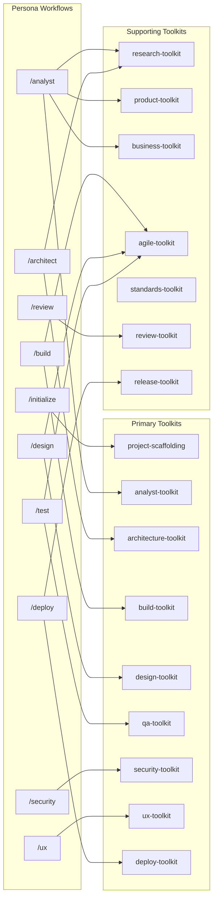
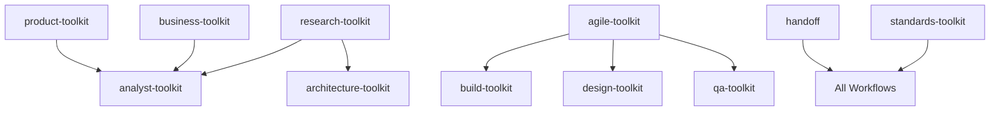

# 🗺️ RAPS Skill Dependency Graph

Visual mapping of skill-to-workflow relationships.

---

## Workflow → Skill Dependencies



---

## Skill Categories

### Persona Toolkits (9)
Primary skills loaded by persona Entry Checklists.

| Skill | Workflow | Lines |
|-------|----------|-------|
| `project-scaffolding` | /initialize | 212 |
| `analyst-toolkit` | /analyst | 185 |
| `architecture-toolkit` | /architect | 145 |
| `build-toolkit` | /build | 95 |
| `design-toolkit` | /design | 115 |
| `qa-toolkit` | /test | 142 |
| `security-toolkit` | /security | 170 |
| `ux-toolkit` | /ux | 130 |
| `deploy-toolkit` | /deploy | 125 |

### Supporting Toolkits (8)
Shared skills loaded by multiple workflows.

| Skill | Used By | Purpose |
|-------|---------|---------|
| `research-toolkit` | /analyst, /architect | Intelligence gathering |
| `product-toolkit` | /analyst | PM/UX direction |
| `business-toolkit` | /analyst | BA strategy |
| `agile-toolkit` | /build, /design, /test | DoR/DoD |
| `standards-toolkit` | /raps-improve | Quality enforcement |
| `review-toolkit` | /review | PR standards |
| `release-toolkit` | /deploy, /release | Versioning |
| `handoff` | All personas | Transition templates |

### Utility Skills (10)
Standalone capabilities invoked on demand.

| Skill | Purpose |
|-------|---------|
| `compliance-check` | Regulatory validation |
| `debug-assist` | Troubleshooting protocols |
| `document-gen` | Documentation automation |
| `estimate` | Effort estimation |
| `generate-tests` | Test case generation |
| `impact-analysis` | Change assessment |
| `import-requirements` | External req ingestion |
| `memory-update` | Context persistence |
| `spec-review` | Specification validation |
| `sync-raps` | Brain↔Repo sync |

---

## Cross-Skill Dependencies



---

## Quick Reference

### Loading a Skill
```markdown
**Load Skill:** `view_file("skills/[skill-name]/SKILL.md")`
```

### Skill Entry Checklist Pattern
1. Read PLAN.md
2. Load primary skill
3. Load supporting skills (if applicable)
4. Load agile-toolkit for DoD (build/design/test)
