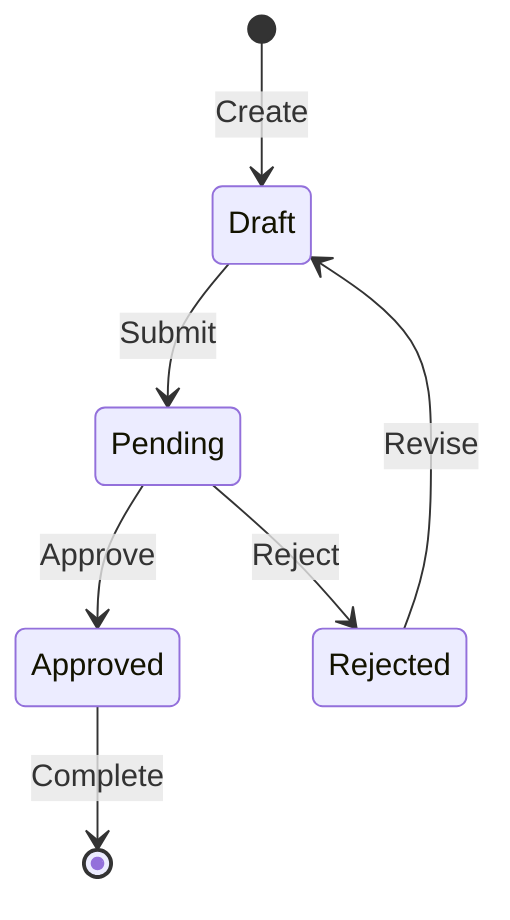

# Analyst Toolkit

## Purpose
Provide standards for writing requirements, user stories, and maintaining traceability across the project lifecycle. Defines the ID conventions and templates for all requirement artifacts.

## When to Use
- Writing or reviewing requirements
- Creating user stories
- Defining use cases
- Establishing traceability
- Validating requirement quality

---

## Tool Interface

### Inputs
| Parameter | Type | Required | Description |
|-----------|------|----------|-------------|
| `action` | enum | ✅ | `"create_requirement"` \| `"validate"` \| `"trace"` |
| `type` | enum | ❌ | Requirement type: `"STRY"` \| `"FREQ"` \| `"NFRQ"` \| `"UCSE"` |
| `id` | string | ❌ | Existing ID to validate or trace |

### Outputs
- **Type:** Markdown
- **Structure:** Formatted requirement or validation report

---

## 1. Traceability ID Standards

> Every artifact gets a unique, searchable ID enabling full traceability.

### ID Format Reference

| Type | Format | Regex | Example |
|------|--------|-------|---------|
| User Story | STRY####### | `^STRY\d{7}$` | STRY0000001 |
| Functional Req | FREQ####### | `^FREQ\d{7}$` | FREQ0000042 |
| Non-Functional | NFRQ####### | `^NFRQ\d{7}$` | NFRQ0000003 |
| Use Case | UCSE####### | `^UCSE\d{7}$` | UCSE0000010 |
| Actor | ACTR####### | `^ACTR\d{7}$` | ACTR0000001 |
| Persona | PRSN####### | `^PRSN\d{7}$` | PRSN0000005 |
| Entity | ENTY####### | `^ENTY\d{7}$` | ENTY0000100 |
| Stakeholder | STKH####### | `^STKH\d{7}$` | STKH0000002 |
| Risk | RISK####### | `^RISK\d{7}$` | RISK0000015 |
| Test Case | TC####### | `^TC\d{7}$` | TC0000201 |
| Change Request | CHNG####### | `^CHNG\d{7}$` | CHNG0000001 |
| Question | QSTN####### | `^QSTN\d{7}$` | QSTN0000033 |
| Dependency | DPND####### | `^DPND\d{7}$` | DPND0000007 |
| Assumption | ASUM####### | `^ASUM\d{7}$` | ASUM0000012 |

### ID Ownership
- **Analyst** creates: STRY, FREQ, NFRQ, UCSE, ACTR, PRSN, ENTY, STKH, QSTN, ASUM, DPND
- **Test** creates: TC
- **Any persona** can create: RISK, CHNG

---

## 2. User Story Standards

### Format
See `./templates/FRD_USER_STORIES.md`

### Story Quality Checklist
- [ ] Follows "As a... I want... So that..." format
- [ ] Actor/Persona is defined (not "user")
- [ ] Benefit is clear (not just restating the action)
- [ ] Has 2+ acceptance criteria
- [ ] Criteria are testable (Given/When/Then)
- [ ] Estimated with story points
- [ ] Fits in one sprint

---

## 3. Functional Requirement Standards

### Format
See `./templates/FRD_FUNCTIONAL_REQUIREMENTS.md`

### Requirement Quality Checklist
- [ ] Starts with "The system shall"
- [ ] Single, atomic behavior (not compound)
- [ ] Testable and measurable
- [ ] Priority assigned (MoSCoW)
- [ ] Linked to source story or stakeholder

---

## 4. Non-Functional Requirement Standards

### Categories
| Category | Examples |
|----------|----------|
| **Performance** | Response time, throughput, latency |
| **Scalability** | Users, data volume, concurrent connections |
| **Reliability** | Uptime, MTBF, recovery time |
| **Security** | Authentication, encryption, audit |
| **Usability** | Accessibility, learning curve |
| **Compliance** | GDPR, SOC2, HIPAA |

### Format
```markdown
### NFRQ0000001: [Title]

**Category:** [Performance/Scalability/etc.]

**Requirement:** The system shall [measurable quality attribute].

| Attribute | Value |
|-----------|-------|
| Target | [Specific metric] |
| Measurement | [How to measure] |
| Priority | MUST / SHOULD |
```

---

## 5. State Machine Diagram Standards

> **REQUIRED** for any entity with multiple states (e.g., Order, Lead, Ticket)

### When to Create
- Entity has a `status` or `state` field
- Transitions between states have conditions
- Different actions available per state

### Format (Mermaid)


### State Definition Table
| State | Description | Allowed Transitions | Triggers |
|-------|-------------|---------------------|----------|
| Draft | Initial state | Submit | User action |
| Pending | Awaiting review | Approve, Reject | Reviewer |
| Approved | Accepted | Complete | System |
| Rejected | Declined | Revise | System |

### Checklist
- [ ] All states documented with descriptions
- [ ] All transitions have triggers defined
- [ ] Guard conditions specified (if applicable)
- [ ] Entry/exit actions noted (if applicable)
- [ ] Terminal states marked

---

## 6. Use Case Standards

### Format
See `./templates/FRD_USE_CASES.md`

---

## 6. Traceability Matrix

### Forward Traceability (Requirements → Implementation)
| Requirement | Stories | Specs | Code | Tests |
|-------------|---------|-------|------|-------|
| FREQ0000001 | STRY0000001 | SPECS.md §3.1 | auth.ts | TC0000001 |
| FREQ0000002 | STRY0000001 | SPECS.md §3.2 | user.ts | TC0000002 |

### Backward Traceability (Tests → Requirements)
| Test | Requirement | Story | Status |
|------|-------------|-------|--------|
| TC0000001 | FREQ0000001 | STRY0000001 | ✅ Pass |

---

## 7. RBAC Permissions Matrix

### Actor-Permission Mapping
| Permission | Guest | User | Admin | System |
|------------|-------|------|-------|--------|
| View public content | ✅ | ✅ | ✅ | ✅ |
| Create account | ✅ | ❌ | ❌ | ❌ |
| Edit own profile | ❌ | ✅ | ✅ | ❌ |
| Delete any user | ❌ | ❌ | ✅ | ❌ |

---

## How to Verify

- [ ] All requirements have valid IDs matching regex
- [ ] User stories follow standard format
- [ ] Acceptance criteria are testable
- [ ] Traceability links are bidirectional
- [ ] No orphan requirements (unlinked)
