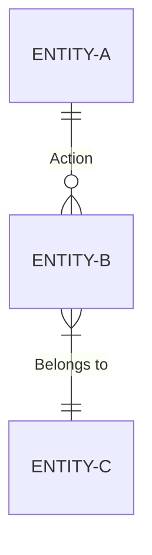
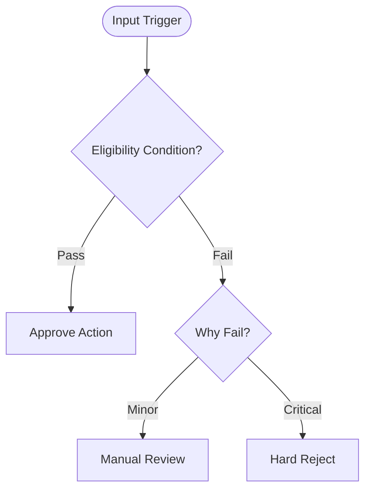
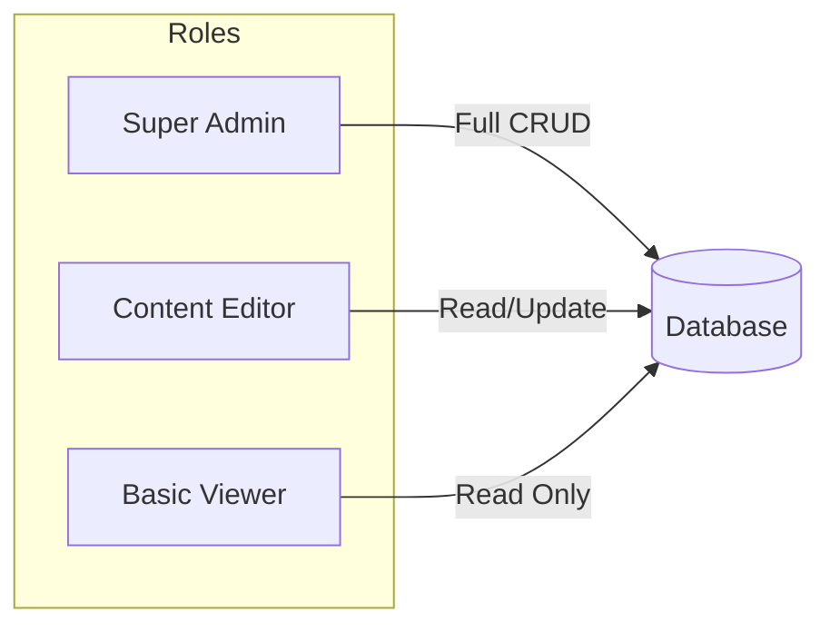
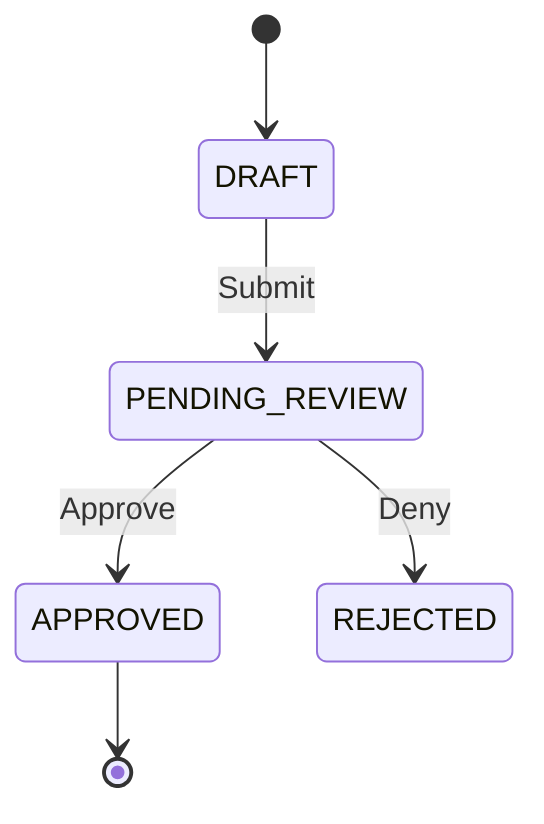

# 📊 DIAGRAM_GUIDE: Enterprise Visual Standards

This guide defines the standards for all visual artifacts generated in Phase 4 of the Analyst workflow. All diagrams must use Mermaid syntax and be stored in `/docs/diagrams/`.

---

## 1. Data Bridge: Logical ERD
**Purpose:** Map conceptual entities and relationships without physical DB constraints.
**Standard:** Use `erDiagram`. Focus on cardinality and business nouns.

**Enterprise Rules:**
- Use **SINGULAR** nouns for entities (e.g., `ORDER`, not `ORDERS`).
- Relationships must be labeled with a verb.
- Define cardinality: `||--o{` (Zero or many), `||--|{` (One or many).

---

## 2. Logic Bridge: Decision Trees
**Purpose:** Deconstruct complex IF/THEN branching logic and eligibility rules.
**Standard:** Use `graph TD` (Top-Down).

**Enterprise Rules:**
- Use **Pills** `([ ])` for start/end points.
- Use **Rhombus** `{ }` for all decision points.
- Labels on lines must be clear (e.g., "Yes", "No", "$ > 100").

---

## 3. Security Bridge: RBAC Matrix
**Purpose:** Visualizing identity-based access control.
**Standard:** Use `graph LR` (Left-Right) or `mindmap`.

---

## 4. Lifecycle Bridge: State Machines
**Purpose:** Track the status transitions of a core object (e.g., Order Status).
**Standard:** Use `stateDiagram-v2`.

---

## Verification Check
- [ ] Does the diagram trace to a `BRD_BUSINESS_RULE.md`?
- [ ] Are all Mermaid syntax errors cleared?
- [ ] Is the document uploaded to `/docs/diagrams/`?
