# Analyst Templates

## 📄 REQUIREMENTS.md Template

Save as: `/docs/requirements/REQUIREMENTS.md`

```markdown
# 📋 REQUIREMENTS: [Feature Name]

**Epic:** [Epic Link or ID]
**Analyst:** /analyst
**Date:** [TIMESTAMP]
**Status:** Draft / Approved
**Date:** [TIMESTAMP]

## 📜 Document History
| Version | Date | Author | Description |
|:---:|:---:|:---:|:---|
| 0.1 | [Date] | /analyst | Initial Draft |
| 1.0 | [Date] | /analyst | Approved Baseline |

---

## 1. Overview

### Business Goal
[What problem does this solve? Why are we building this?]

### Target Users
[Who will use this feature?]

### Success Metrics
[How do we measure success?]

### Glossary
| Term | Definition |
|------|------------|
| **Client** | External payer for the project. |
| **Customer** | End-user of the system (may differ from Client). |
| **Lead** | Unqualified potential opportunity. |


---

## 2. Functional Requirements

### FREQ0000001: [Requirement Title]
- **Status:** Draft / Approved
- **Priority:** MUST / SHOULD / COULD
- **Description:** [What the system must do]
- **Acceptance Criteria:**
  - [ ] [Testable condition 1]
  - [ ] [Testable condition 2]

---

## 3. Non-Functional Requirements

### NFRQ0000001: Performance
- **Status:** Draft / Approved
- Response time: [e.g., < 200ms for API calls]
- **Data Retention:** [e.g., Logs stored for 1yr, active data forever]
- **Archival:** [e.g., Soft-delete, move to cold storage after 3yrs]


---

## 4. User Stories

### STRY0000001: [Story Title]
**Status:** Draft / Approved
**As a** [user type]
**I want to** [action/goal]
**So that** [benefit/reason]

**Acceptance Criteria:**
- [ ] Given [context], when [action], then [result]

**Priority:** MUST / SHOULD / COULD
**Estimated Effort:** S / M / L / XL

---

## 5. Use-Case Diagram

### Actors
| ID | Actor | Type | Description |
|----|-------|------|-------------|
| ACTR0000001 | [Actor Name] | Primary | [Description] |

### Use-Case Diagram (Mermaid)
[Insert Mermaid code here]

---

## 6. Out of Scope
> [!IMPORTANT]
> These items are explicitly NOT included.

- [Feature 1]

---

## 7. Assumptions
> [!WARNING]
> If incorrect, requirements may change.

- **ASUM0000001:** [Assumption]

---

## 8. Open Questions
| ID | Question | Owner | Status |
|------|----------|-------|--------|
| QSTN0000001 | [Question] | USER | Open |

---

## 9. Dependencies
| ID | Dependency | Type | Status |
|------|------------|------|--------|
| DPND0000001 | [Item] | Internal | Ready |

---

## 10. Data Dictionary

### Entities
#### ENTY0000001: [Entity Name]
| Attribute | Type | Required | Description |
|-----------|------|----------|-------------|
| id | UUID | Yes | Identifier |

---

## 11. Wireframes
## 11. Wireframes & UI Structure

### Option A: UI Component Map (Preferred)
> Use this to define *content structure* without drawing pixels.

**Page:** [Page Name]
| Zone | Component | Content / Data | Actions / Interactions |
| :--- | :--- | :--- | :--- |
| **Header** | PageTitle | "Project Dashboard" | - |
| **Sidebar** | NavMenu | Links: Home, Projects, Tasks | Active state highlight |
| **Main** | FilterBar | Search input, Status dropdown | `[Apply Filter]` updates grid |
| **Main** | DataGrid | Cols: Name, Owner, Due Date | Click row → Open Detail View |
| **Footer** | Pagination | "Showing 1-10 of 50" | `[Next]`, `[Prev]` |

### Option B: High-Level Layout (Mermaid)
> Use this to show spatial arrangement.


### Option C: Low-Fi Mockup (Draw.io)
> Use for complex interactions. Copy this XML into a `.drawio` file.

```xml
<!-- Simple Dashboard Shell -->
<mxfile host="app.diagrams.net">
  <diagram name="Wireframe">
    <mxGraphModel>
      <root>
        <mxCell id="0"/>
        <mxCell id="1" parent="0"/>
        <!-- Browser Window -->
        <mxCell id="2" value="" style="swimlane;startSize=0;" vertex="1" parent="1">
          <mxGeometry x="40" y="40" width="800" height="600" as="geometry"/>
        </mxCell>
        <!-- Sidebar -->
        <mxCell id="3" value="Nav" style="rounded=0;whiteSpace=wrap;html=1;fillColor=#f5f5f5;" vertex="1" parent="2">
          <mxGeometry x="0" y="0" width="200" height="600" as="geometry"/>
        </mxCell>
        <!-- Header -->
        <mxCell id="4" value="Header" style="rounded=0;whiteSpace=wrap;html=1;" vertex="1" parent="2">
          <mxGeometry x="200" y="0" width="600" height="60" as="geometry"/>
        </mxCell>
        <!-- Content -->
        <mxCell id="5" value="Content Area" style="rounded=0;whiteSpace=wrap;html=1;dashed=1;" vertex="1" parent="2">
          <mxGeometry x="220" y="80" width="560" height="500" as="geometry"/>
        </mxCell>
      </root>
    </mxGraphModel>
  </diagram>
</mxfile>
```

---

## 12. Stakeholder Register
| ID | Name | Role | Influence | Interest |
|----|------|------|-----------|----------|
| STKH0000001 | [Name] | [Role] | High | High |

---

## 13. Risk Register
| ID | Risk | Severity | Mitigation |
|----|------|----------|------------|
| RISK0000001 | [Risk] | High | [Strategy] |

## 14. RBAC Matrix (Permissions)
| Role | Create | Read | Update | Delete | Special Actions |
|:--- |:---:|:---:|:---:|:---:|:---|
| **Admin** | ✅ | ✅ | ✅ | ✅ | Archive, Restore |
| **Manager** | ✅ | ✅ | ✅ | ❌ | Approve |
| **User** | ❌ | ✅ | ✅ (Own) | ❌ | - |
| **Guest** | ❌ | ✅ (Public) | ❌ | ❌ | - |

## 15. Communication & Notifications
| Trigger Event | Audience | Channel | Template ID |
|:--- |:--- |:--- |:--- |
| Order Created | User | Email | `EMAIL_ORDER_CONF` |
| Low Stock | Admin | In-App + SMS | `ALERT_LOW_STOCK` |
| Monthly Report | Manager | Email | `RP_MTH_SUMMARY` |
```

---

## 📊 Diagram Templates

### Use-Case Diagram (.mmd)
**Filename:** `use_case_[feature].mmd`

```mermaid
flowchart LR
    subgraph System["🖥️ System Name"]
        UC1["UCSE0000001: Use Case 1"]
        UC2["UCSE0000002: Use Case 2"]
    end

    Actor1["👤 Primary User"]
    Actor1 --> UC1
    UC1 -.->|«include»| UC2
```



### Use-Case Diagram (.drawio)
**Filename:** `use_case_[feature].drawio`

```xml
<mxfile host="app.diagrams.net" agent="RAPS Analyst">
  <diagram name="Use Case Diagram" id="use-case-001">
    <mxGraphModel>
      <root>
        <mxCell id="0"/>
        <mxCell id="1" parent="0"/>
        <!-- System, Actors, Use Cases Structure -->
      </root>
    </mxGraphModel>
  </diagram>
</mxfile>
```

### Lifecycle Diagram (.mmd)
**Filename:** `lifecycle_[feature].mmd`


### Process Flow Diagram (.mmd)
**Filename:** `process_flow_[feature].mmd`

```mermaid
flowchart TD
    subgraph AsIs["📋 Current Process (As-Is)"]
        A1[Start] --> B1[Manual Step 1]
    end

    subgraph ToBe["🚀 Future Process (To-Be)"]
        A2[Start] --> B2[Automated Step 1]
    end
```



### Conceptual Domain Model (Mermaid Class Diagram)
> **Goal:** Show relationships between Business Concepts (Entities), NOT database tables.
> **Do:** Use business names (Customer, Order).
> **Don't:** Define types (varchar), keys (PK/FK), or join tables.

**Filename:** `domain_model_[feature].mmd`


---

## 📝 Cross-Persona Notes Template

Add to `HANDOFF_NOTES.md` under `## /analyst → /architect`:

```markdown
## /analyst → /architect
**Date:** [TIMESTAMP]
**Feature:** [Feature name]

### Requirements Summary
- Total functional requirements: X
- Total user stories: Y
- Priority breakdown: X MUST, Y SHOULD, Z COULD

### Key Decisions
- [Decision 1]

### Watch Out For
- [Edge case or complexity]

### Open Questions
- [Questions for Architect]

### Files
- `/docs/requirements/REQUIREMENTS.md`
```
