# Architecture Toolkit (The Design Engine)

> [!IMPORTANT]
> **ANTI-HALLUCINATION PROTOCOL**
> 1. **NO GHOST APIS:** Verify all third-party endpoints in `RSRCH_SYNTHESIS.md` before adding to `ICD.md`.
> 2. **VERSION LOCK:** Verify library versions in `package.json` or `RSRCH_EVIDENCE_LOG.md`.
> 3. **ADR TRACEABILITY:** Every major decision MUST link to an `RS-####` evidence ID if applicable.
> 4. **INTELLIGENCE INGESTION:** You MUST read `RSRCH_SYNTHESIS.md` and map `Technical Constraints` to `SPECS.md`.

## Purpose
Provide templates and standards for technical specifications, architecture decision records (ADRs), and system design documentation.

## When to Use
- Writing technical specifications (SPECS.md)
- Making architectural decisions
- Designing system components
- Documenting API contracts

---

## 🧠 Thinking Logic (The Visual Bridge)

### 1. Logic-to-Schema (The Data Bridge)
> **Rule**: Conceptual entities in `logical_erd.mmd` must map 1:1 to physical tables in `SPECS.md`.
1. **Identify Parent Entities**: Start with mandatory `||--` relationships.
2. **Inject Source Trace**: Every field must have a `(Ref: RS-####)` identifying its origin (Research or Analyst Story).
3. **Verify Constraints**: Cross-reference `decision_tree.mmd` for mandatory/nullable statuses.

### 2. Decision-to-Sequence (The Logic Bridge)
> **Rule**: Every 'Rhombus' { } in `decision_tree.mmd` must have a corresponding loop or alt block in the **Sequence Diagram**.
1. **Map Forks**: Map IF/THEN logic to API response codes (e.g., Success 200 vs Conflict 409).
2. **Trace Error Paths**: Ensure the "Red Paths" from the Analyst's logic are handled by technical error boundaries.

---

## 🛠️ Standards & Templates

### 1. Specification Architecture
> **Templates Location**: `templates/`

- **Technical Specs**: Use `templates/SPECS_TEMPLATE.md` (Mandated).
- **Decision Records**: Use `templates/ADR_TEMPLATE.md` for all major tech choices.
- **API Contracts**: Use `templates/ICD_API_SPEC.md` for detailed integration design.

---

## 3. API Design Standards

### RESTful Conventions
| Action | Method | Endpoint | Status Code |
|--------|--------|----------|-------------|
| List | GET | /resources | 200 |
| Create | POST | /resources | 201 |
| Read | GET | /resources/:id | 200 |
| Update | PUT | /resources/:id | 200 |
| Partial Update | PATCH | /resources/:id | 200 |
| Delete | DELETE | /resources/:id | 204 |

### Error Response Format
```json
{
  "error": {
    "code": "VALIDATION_ERROR",
    "message": "Invalid input",
    "details": [
      { "field": "email", "message": "Invalid format" }
    ]
  }
}
```

---

## 4. Sequence Diagram Standards

> **REQUIRED** for complex interactions between components

### When to Create
- Multi-component interactions (API → Service → DB)
- Authentication/authorization flows
- Async processing or message queues
- Error handling across boundaries

### Format (Mermaid)

```mermaid
sequenceDiagram
    actor User
    participant CLI
    participant Service
    participant DB

    User->>CLI: expense add --amount 50
    CLI->>Service: createExpense(data)
    Service->>DB: INSERT INTO expenses
    DB-->>Service: { id: 1 }
    Service-->>CLI: Expense created
    CLI-->>User: ✅ Expense added [ID: 1]
```


### Checklist
- [ ] All participants labeled clearly
- [ ] Message names match function/method names
- [ ] Response arrows use dashed lines (--)
- [ ] Alt/Opt blocks for conditional flows
- [ ] Notes for complex logic

---

## How to Verify

- [ ] SPECS.md covers all requirements
- [ ] API endpoints documented with examples
- [ ] Data model defined with relationships
- [ ] Security considerations addressed
- [ ] Non-functional requirements specified
- [ ] Sequence diagrams for complex flows
- [ ] Major decisions logged to DECISION_LOG.md
