# Architecture Toolkit (The Design Engine)

> [!IMPORTANT]
> **ANTI-HALLUCINATION PROTOCOL**
> 1. **NO GHOST APIS:** Verify all third-party endpoints in `RSRCH_SYNTHESIS.md` before adding to `ICD.md`.
> 2. **VERSION LOCK:** Verify library versions in `package.json` or `RSRCH_EVIDENCE_LOG.md`.
> 3. **ADR TRACEABILITY:** Every major decision MUST link to an `RS-####` evidence ID if applicable.
> 4. **INTELLIGENCE INGESTION:** You MUST read `RSRCH_SYNTHESIS.md` and map `Technical Constraints` to `SPECS.md`.

## Purpose
Provide templates and standards for technical specifications, architecture decision records (ADRs), and system design documentation.

## When to Use
- Writing technical specifications (SPECS.md)
- Making architectural decisions
- Designing system components
- Documenting API contracts

---

## 🧠 Thinking Logic (The Bridge)

### 🔍 Intelligence Ingestion (Feasibility Engine)
Before drafting specifications:
1. **Map Technical Constraints**: Review `⚙️ Technical Constraints` in `RSRCH_SYNTHESIS.md`.
2. **Verify API Sanity**: Cross-reference `ICD.md` endpoints with `RSRCH_EVIDENCE_LOG.md` (Check RS-####).
3. **Trace Decisions**: Ensure every major architectural choice (ADR) cites an evidence ID from research if it was influenced by external tech.

---

## Tool Interface

### Inputs
| Parameter | Type | Required | Description |
|-----------|------|----------|-------------|
| `action` | enum | ✅ | `"create_spec"` \| `"create_adr"` \| `"design_api"` |
| `feature_name` | string | ❌ | Feature being specified |

### Outputs
- **Type:** Markdown
- **Structure:** SPECS.md section or ADR document in `/docs/technical/`

---

## 1. SPECS.md Template

```markdown
# Technical Specifications

## Document Control
| Attribute | Value |
|-----------|-------|
| Version | 1.0 |
| Author | /architect |
| Date | [TIMESTAMP] |
| Status | Draft / Review / Approved |

---

## 1. Overview

### 1.1 Purpose
[What this system/feature does]

### 1.2 Scope
[What is included and excluded]

### 1.3 Requirements Traceability
| Requirement | Description |
|-------------|-------------|
| FREQ0000001 | [Summary] |
| STRY0000001 | [Summary] |

---

## 2. System Architecture

### 2.1 High-Level Design
[Architecture diagram or description]

### 2.2 Component Overview
| Component | Responsibility |
|-----------|----------------|
| [Component] | [What it does] |

### 2.3 Technology Stack
| Layer | Technology | Rationale |
|-------|------------|-----------|
| Frontend | [Tech] | [Why] |
| Backend | [Tech] | [Why] |
| Database | [Tech] | [Why] |

---

## 3. Data Model

### 3.1 Entity Definitions
| Entity | Description | Key Attributes |
|--------|-------------|----------------|
| [Entity] | [Description] | [Attributes] |

### 3.2 Database Schema
```sql
CREATE TABLE [table_name] (
    id UUID PRIMARY KEY,
    -- fields
);
```

### 3.3 Relationships
[ERD or relationship description]

---

## 4. API Specification

### 4.1 Endpoints Overview
| Method | Endpoint | Description |
|--------|----------|-------------|
| GET | /api/v1/resource | List resources |
| POST | /api/v1/resource | Create resource |

### 4.2 Endpoint Details

#### GET /api/v1/resource
**Description:** [What it does]
**Auth:** Required / Optional
**Request:**
```json
{
  "query_param": "value"
}
```
**Response (200):**
```json
{
  "data": [],
  "meta": {}
}
```
**Errors:**
| Code | Meaning |
|------|---------|
| 400 | Invalid request |
| 401 | Unauthorized |
| 404 | Not found |

---

## 5. Security Considerations

### 5.1 Authentication
[Auth mechanism]

### 5.2 Authorization
[RBAC or permission model]

### 5.3 Data Protection
[Encryption, PII handling]

---

## 6. Non-Functional Requirements

| Requirement | Target | Measurement |
|-------------|--------|-------------|
| Response Time | < 200ms | P95 latency |
| Availability | 99.9% | Monthly uptime |
| Throughput | 1000 RPS | Load test |

---

## 7. Dependencies

| Dependency | Version | Purpose |
|------------|---------|---------|
| [Library] | ^X.Y.Z | [Why] |

---

## 8. Deployment & Operations

### 8.1 Environments
| Environment | Purpose | URL |
|-------------|---------|-----|
| Development | Testing | localhost |
| Staging | Pre-prod | staging.example.com |
| Production | Live | example.com |

### 8.2 Configuration
| Variable | Description | Default |
|----------|-------------|---------|
| DATABASE_URL | DB connection | - |

---

## 9. Open Questions

| ID | Question | Impact | Status |
|----|----------|--------|--------|
| Q1 | [Question] | [Impact] | Open |
```

---

## 2. Architecture Decision Record (ADR) Template

```markdown
# ADR-[NUMBER]: [Title]
> **File Location:** `/docs/technical/ADR-[000]-[Title].md`

## Status
Proposed / Accepted / Deprecated / Superseded

## Context
[What is the issue that we're seeing that motivates this decision?]

## Decision
[What is the change that we're proposing and/or doing?]

## Consequences
### Positive
- [Benefit 1]
- [Benefit 2]

### Negative
- [Trade-off 1]
- [Trade-off 2]

### Neutral
- [Side effect]

## Alternatives Considered
| Option | Pros | Cons | Decision |
|--------|------|------|----------|
| [Option 1] | [Pros] | [Cons] | Rejected |
| [Option 2] | [Pros] | [Cons] | **Selected** |

## References
- [Link to relevant docs]
```

---

## 3. API Design Standards

### RESTful Conventions
| Action | Method | Endpoint | Status Code |
|--------|--------|----------|-------------|
| List | GET | /resources | 200 |
| Create | POST | /resources | 201 |
| Read | GET | /resources/:id | 200 |
| Update | PUT | /resources/:id | 200 |
| Partial Update | PATCH | /resources/:id | 200 |
| Delete | DELETE | /resources/:id | 204 |

### Error Response Format
```json
{
  "error": {
    "code": "VALIDATION_ERROR",
    "message": "Invalid input",
    "details": [
      { "field": "email", "message": "Invalid format" }
    ]
  }
}
```

---

## 4. Sequence Diagram Standards

> **REQUIRED** for complex interactions between components

### When to Create
- Multi-component interactions (API → Service → DB)
- Authentication/authorization flows
- Async processing or message queues
- Error handling across boundaries

### Format (Mermaid)

```mermaid
sequenceDiagram
    actor User
    participant CLI
    participant Service
    participant DB

    User->>CLI: expense add --amount 50
    CLI->>Service: createExpense(data)
    Service->>DB: INSERT INTO expenses
    DB-->>Service: { id: 1 }
    Service-->>CLI: Expense created
    CLI-->>User: ✅ Expense added [ID: 1]
```


### Checklist
- [ ] All participants labeled clearly
- [ ] Message names match function/method names
- [ ] Response arrows use dashed lines (--)
- [ ] Alt/Opt blocks for conditional flows
- [ ] Notes for complex logic

---

## How to Verify

- [ ] SPECS.md covers all requirements
- [ ] API endpoints documented with examples
- [ ] Data model defined with relationships
- [ ] Security considerations addressed
- [ ] Non-functional requirements specified
- [ ] Sequence diagrams for complex flows
- [ ] Major decisions logged to DECISION_LOG.md
