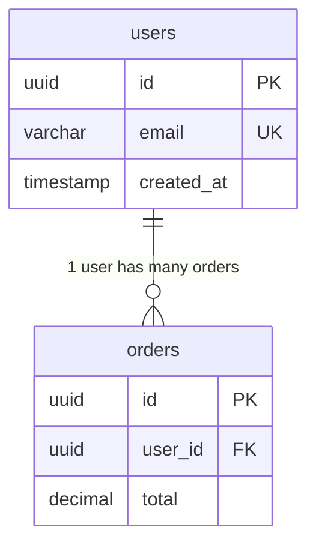
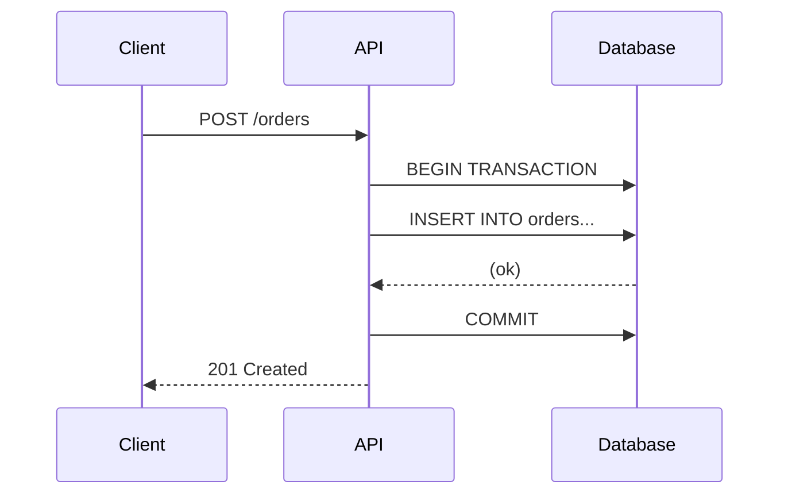
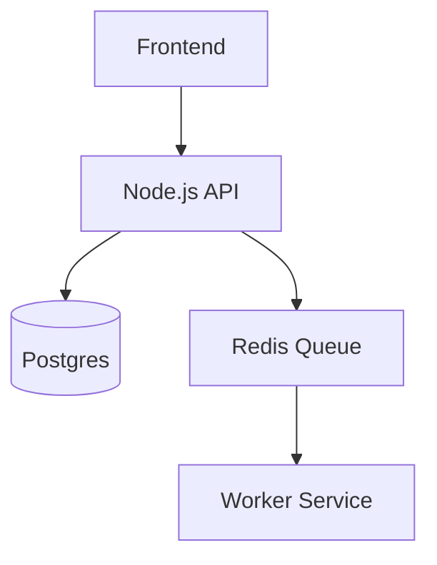

# Architecture Templates

## 📐 SPECS.md Template
Save as: `/docs/SPECS.md` (or append to it)

```markdown
# 📐 SYSTEM SPECIFICATION: [Feature Name]

**Status:** Draft / Approved
**Source:** [Requirement IDs]

## 1. Logic Flow (Algorithm)
1. User actions [X]
2. System validates [Y]
   - IF valid: Proceed to 3
   - ELSE: Return Error [Z]
3. System triggers [Action]

## 2. Data Schema
### Table: [Name]
| Column | Type | Constraints | Description |
|--------|------|-------------|-------------|
| id | UUID | PK | |

## 3. API Contract
### [METHOD] /api/[endpoint]
- **Params:** `{ ... }`
- **Response:** `200 OK { ... }`

## 4. Edge Cases
- [Case 1]: [Handling]
- [Case 2]: [Handling]
```

## 📨 Cross-Persona Note Template
Append to `HANDOFF_NOTES.md`

```markdown
## /architect → /build (or /design)
**Date:** [TIMESTAMP]
**Task:** [Feature name]

### Spec Summary
- [Key point 1]
- [Key point 2]
- Reference: `/docs/SPECS.md`
```

## 🤖 Auto-Draft Template
Save as: `/docs/SPECS_DRAFT.md`

```markdown
# 📋 SPEC DRAFT: [Feature Name]
> ⚠️ **AI-GENERATED DRAFT** - Human review required.

## Proposed Logic Flow
[...]

## Proposed Data Schema
[...]
```

## 📊 Technical Diagram Templates

### Physical ER Diagram (Database)
**Filename:** `schema_[feature].mmd`



### Sequence Diagram (API/Logic Flow)
**Filename:** `sequence_[feature].mmd`



### Component Diagram (Architecture)
**Filename:** `component_[feature].mmd`


