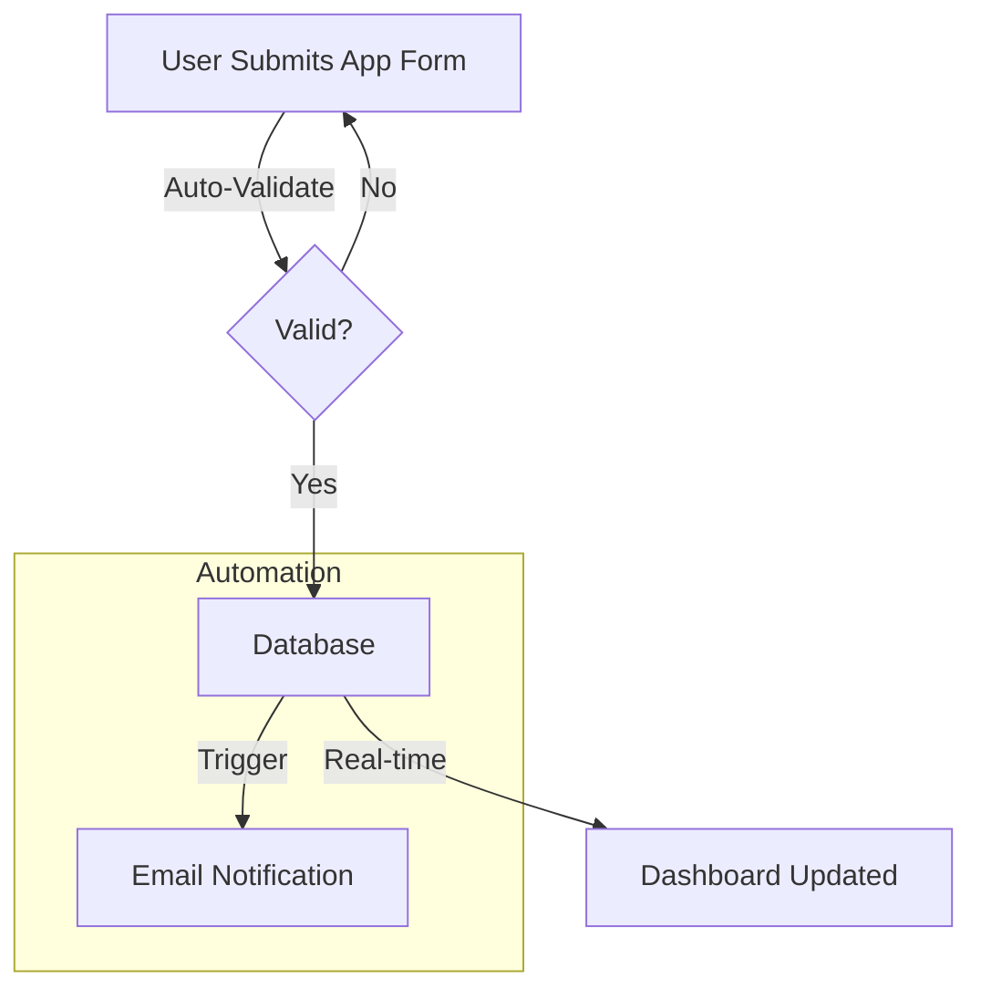

# 🗺️ Business Process Map: [Process Name]

## 1. As-Is Process (Current State)
> The legacy workflow (often Excel/Manual based).

```mermaid
graph TD
    A[Stakeholder Starts] -->|Emails Excel| B[Middleman]
    B -->|Manual Entry| C[Legacy System]
    C -->|Wait 24h| D[Report Generated]
    style B fill:#f9f,stroke:#333 -- Bottleneck
```

**Pain Points Identified:**
1. Manual entry at Step B causes errors.
2. 24h delay at Step C is unacceptable.

---

## 2. To-Be Process (Future State)
> The optimized, app-driven workflow.



**Improvements:**
- Real-time validation (No bad data).
- Instant reporting (No wait time).
- Automated notification (No manual email).

## 3. Role Responsibilities (RACI)
| Step | Responsible | Accountable | Technology |
|------|-------------|-------------|------------|
| Submit | User | Manager | Web App |
| Validate| System | Architect | API |
