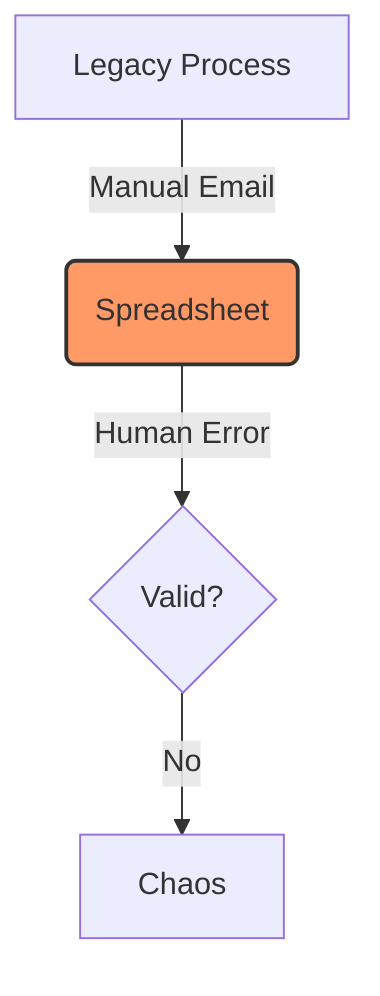
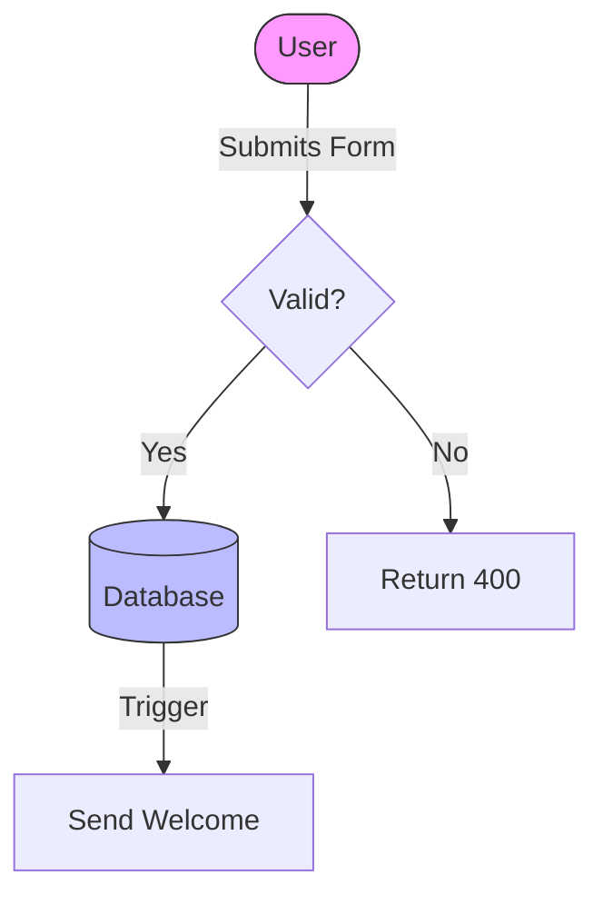

# 🗺️ Business Process & Workflow Map
> **Usage:** Visualizes the User Journey and Data Flow.
> **Critical:** This document governs the Router Config (Frontend) and State Machine Enums (Backend).

## 1. The Legacy State (As-Is)
> **Source:** `INTERVIEW_QUESTIONNAIRE.md` (Section 3).
> **Goal:** Identify the bottleneck we are killing.

### Problem Statement (The "Why")
*   **Bottleneck:** [e.g. "Step B takes 24 hours"]
*   **Risk:** [e.g. "Excel file gets corrupted"]

## 2. The "To-Be" Workflow (Happy Path)
> **Goal:** The ideal user journey.

## 2. Exception Handling (The Unhappy Path)
> **Goal:** How we handle failures. REQUIRED for QA Testing.

*   **Scenario A: Payment Failed**
    *   **Trigger:** Stripe Webhook returns `charge.failed`.
    *   **Action:** Update State -> `PAYMENT_FAILED`. Email User. Do NOT unlock feature.
*   **Scenario B: User Offline**
    *   **Action:** Save to LocalStorage. Retry on reconnect.

## 3. State Machine Definition (For Architect)
> **Goal:** Precise State Enums for the Database.

| Entity | Valid States (Enum) | Transition Rules |
| :--- | :--- | :--- |
| **Order.status** | `DRAFT`, `PENDING`, `PAID`, `REFUNDED` | `PAID` -> `DRAFT` is **ILLEGAL**. |
| **User.status** | `ACTIVE`, `BANNED`, `ARCHIVED` | `BANNED` users cannot log in. |

## 4. UI Journey Map (For Design)
> **Goal:** Mapping Steps to Screens.

| Step | User Action | URL Route | Key UI Component |
| :--- | :--- | :--- | :--- |
| 1. Signup | Entering Email | `/signup` | `SignupForm.tsx` |
| 2. Onboarding | Selecting Role | `/onboarding/role` | `RoleCard.tsx` |
| 3. Dashboard | Viewing Stats | `/dashboard` | `StatsGrid.tsx` |

## 5. Process Delta & ROI (The Business Case)
> **Goal:** Quantify the value of this change (The "PowerPoint Slide" Stats).

| Metric | As-Is (Legacy) | To-Be (New) | Delta (Improvement) |
| :--- | :--- | :--- | :--- |
| **Touchpoints** | [e.g. 5 People] | [e.g. 1 Person] | **-80% Labor** |
| **Cycle Time** | [e.g. 24 Hours] | [e.g. Real-time] | **Instant** |
| **Error Rate** | [e.g. 10%] | [e.g. 0%] | **Eliminated** |

### Executive Summary (Pitch Deck)
"By automating the [Process], we reduce cycle time by **[X]%** and eliminate **[Y]** manual steps, resulting in an estimated saving of **[$Z]** per year."
