# Impact Analysis Skill

## Purpose
Assess the ripple effects of proposed changes to requirements, specifications, or code. Identify affected components, update effort estimates, and highlight risks.

## When to Use
- Requirement changes requested
- Scope additions or reductions
- Bug fixes affecting multiple components
- Refactoring decisions
- Before approving change requests (CHNG)

---

## Instructions

### 1. Identify the Change
Document the proposed change:
- What is changing?
- What triggered the change?
- Who requested it?

### 2. Trace Dependencies

#### Requirement Impact
Starting from the changed item, trace:
```
FREQ → STRY → UCSE → SPEC → Code → Tests
```

#### Code Impact
For code changes, identify:
- Direct dependencies (imports, calls)
- Indirect dependencies (shared state, events)
- Test coverage for affected areas

### 3. Categorize Affected Items

| Category | Items to Check |
|----------|----------------|
| Requirements | FREQs that reference or depend on changed item |
| User Stories | STRYs affected by requirement change |
| Specifications | SPEC sections that need updating |
| Code | Files that import or use changed code |
| Tests | Test cases that validate changed behavior |
| Documentation | Docs that describe changed functionality |

### 4. Estimate Impact

#### Impact Score
| Level | Criteria | Action |
|-------|----------|--------|
| 🟢 Low | 1-2 files, no spec changes | Proceed |
| 🟡 Medium | 3-5 files, minor spec updates | Review with team |
| 🔴 High | 6+ files, major spec changes | Full re-planning |
| ⚫ Critical | Architecture change | Stakeholder approval |

### 5. Generate Report

---

## Impact Analysis Template

```markdown
# 🔄 IMPACT ANALYSIS: [Change Description]

**Requested By:** [Name/Role]
**Date:** [TIMESTAMP]
**Change Request ID:** CHNG#######

---

## Change Summary

### What's Changing
[Clear description of the change]

### Why
[Business justification or trigger]

### Original State
[Current behavior/requirement]

### Proposed State
[New behavior/requirement]

---

## Impact Assessment

### Impact Score: 🟡 MEDIUM

| Metric | Value |
|--------|-------|
| Affected Requirements | X |
| Affected Stories | X |
| Affected Specs | X |
| Affected Files | X |
| Affected Tests | X |
| Estimated Rework | X hours |

---

## Affected Items

### Requirements
| ID | Title | Impact | Action Needed |
|----|-------|--------|---------------|
| FREQ0000001 | [Title] | Modify | Update acceptance criteria |
| FREQ0000002 | [Title] | Review | Verify still valid |

### User Stories
| ID | Title | Impact | Action Needed |
|----|-------|--------|---------------|
| STRY0000001 | [Title] | Modify | Update AC |

### Specifications
| Section | Impact | Action Needed |
|---------|--------|---------------|
| API Endpoints | Modify | Update request/response |
| Data Model | None | No change |

### Code Files
| File | Impact | Change Description |
|------|--------|-------------------|
| /backend/auth.ts | Modify | Update validation logic |
| /api/users.ts | Modify | Add new field |

### Test Cases
| ID | Impact | Action Needed |
|----|--------|---------------|
| TC0000001 | Modify | Update expected result |
| TC0000002 | Delete | No longer valid |
| NEW | Create | New test for change |

---

## Dependency Graph

```mermaid
flowchart TD
    CHNG["🔄 Change Request"]
    CHNG --> FREQ1["FREQ0000001"]
    FREQ1 --> STRY1["STRY0000001"]
    STRY1 --> SPEC["SPECS.md §3.2"]
    SPEC --> CODE1["/backend/auth.ts"]
    SPEC --> CODE2["/api/users.ts"]
    CODE1 --> TC1["TC0000001"]
    CODE2 --> TC2["TC0000002"]
```



---

## Risk Assessment

| Risk | Probability | Impact | Mitigation |
|------|-------------|--------|------------|
| Regression in [area] | Medium | High | Expand test coverage |
| Timeline delay | Low | Medium | Prioritize over new work |

---

## Effort Estimate

| Phase | Effort | Persona |
|-------|--------|---------|
| Requirements update | X hours | /analyst |
| Spec update | X hours | /architect |
| Code changes | X hours | /build |
| UI changes | X hours | /design |
| Test updates | X hours | /test |
| **Total** | **X hours** | - |

---

## Recommendation

- [ ] ✅ **Approve** - Low risk, proceed
- [ ] ⚠️ **Approve with conditions** - [Conditions]
- [ ] ❌ **Reject** - [Reason]
- [ ] 🔄 **Defer** - [Timeline suggestion]

---

## Next Steps
1. [First action]
2. [Second action]
3. [Third action]
```

---

## How to Verify
- All affected items identified
- Dependency graph accurate
- Effort estimate realistic
- Risks documented
- Clear recommendation provided
