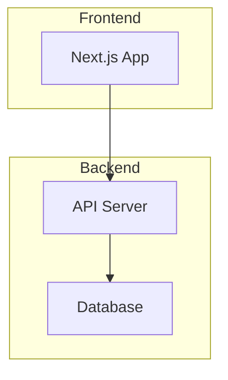

# Onboard Team Member Skill

## Purpose
Create comprehensive onboarding documentation that allows new team members to understand the project quickly and start contributing.

## When to Use
- New developer joining project
- Handoff to new team
- Project documentation refresh
- Self-onboarding after break

---

## Instructions

### 1. Gather Project Context
Read and summarize:
- `PLAN.md` - Project overview and current state
- `README.md` - Project description
- `raps.config.json` - Tech stack and preferences
- `/docs/SPECS.md` - Architecture overview
- `SESSION_LOG.md` - Recent activity

### 2. Identify Key Areas

| Area | What to Document |
|------|------------------|
| Project Overview | What we're building, why |
| Architecture | High-level system design |
| Tech Stack | Languages, frameworks, tools |
| Codebase | Folder structure, key files |
| Workflows | RAPS processes, commands |
| Environment | Setup instructions |
| Current State | Active work, blockers |

### 3. Generate Onboarding Guide

---

## Onboarding Template

```markdown
# 🎉 Welcome to [Project Name]!

**Your Role:** [Role being onboarded]
**Guide Updated:** [TIMESTAMP]
**Expected Onboarding Time:** X hours

---

## 📋 Onboarding Checklist

### Day 1: Setup & Orientation
- [ ] Read this entire document
- [ ] Set up development environment
- [ ] Run the project locally
- [ ] Review PLAN.md
- [ ] Explore the codebase

### Day 2: Deep Dive
- [ ] Read SPECS.md
- [ ] Review recent PRs/commits
- [ ] Understand current sprint
- [ ] Shadow existing team member

### Day 3: First Contribution
- [ ] Pick a small task
- [ ] Make your first PR
- [ ] Complete code review

---

## 🎯 Project Overview

### What We're Building
[Clear 2-3 sentence description]

### Why It Matters
[Business context and goals]

### Target Users
[Who uses this]

### Current Phase
[Where we are in development]

---

## 🏗️ Architecture

### System Overview


### Key Components
| Component | Purpose | Location |
|-----------|---------|----------|
| [Component 1] | [Purpose] | `/path` |
| [Component 2] | [Purpose] | `/path` |

---

## 💻 Tech Stack

| Category | Technology | Version |
|----------|------------|---------|
| Frontend | [e.g., Next.js] | [version] |
| Backend | [e.g., Node.js] | [version] |
| Database | [e.g., PostgreSQL] | [version] |
| Styling | [e.g., Tailwind] | [version] |

---

## 📁 Codebase Structure

```
project-root/
├── /backend         # API and business logic
│   ├── /api         # Route handlers
│   └── /lib         # Shared utilities
├── /frontend        # UI components and pages
│   ├── /components  # Reusable UI
│   └── /pages       # Page routes
├── /docs            # Specifications
├── /tests           # Test suites
├── PLAN.md          # Master Ledger
└── README.md        # Project readme
```

### Key Files
| File | Purpose |
|------|---------|
| `/backend/api/index.ts` | API entry point |
| `/frontend/pages/_app.tsx` | App wrapper |
| `/docs/SPECS.md` | Technical specifications |

---

## 🛠️ Development Setup

### Prerequisites
- [Prerequisite 1 with version]
- [Prerequisite 2 with version]

### Installation
```bash
# Clone repository
git clone [repo-url]
cd [project-name]

# Install dependencies
npm install

# Set up environment
cp .env.example .env
# Edit .env with your values

# Run locally
npm run dev
```

### Verify Setup
```bash
# Should see "Running on http://localhost:3000"
npm run dev

# Run tests
npm test
```

---

## 🔄 RAPS Workflow

This project uses the **RAPS methodology**:

| Command | Purpose |
|---------|---------|
| `/research` | Gather data and insights |
| `/analyst` | Define requirements |
| `/architect` | Write technical specs |
| `/build` | Implement backend |
| `/design` | Implement frontend |
| `/test` | Verify and QA |

### Quick Commands
```bash
# Check project status
/status

# Validate project health
/health
```

See: `/docs/RAPS_METHODOLOGY.md`

---

## 📊 Current State

### Active Sprint
[Sprint N goal]

### In Progress
| Task | Owner | Status |
|------|-------|--------|
| [Task 1] | [Person] | 🛠️ In Progress |
| [Task 2] | [Person] | ⏳ Waiting |

### Blockers
- [Current blocker 1]

### Recent Decisions
- [Decision 1] — Why: [Reason]

---

## 👥 Team

| Role | Name | Focus |
|------|------|-------|
| [Role 1] | [Name] | [Focus area] |
| [Role 2] | [Name] | [Focus area] |

---

## 📚 Key Resources

### Internal
- [PLAN.md](./PLAN.md) - Master Ledger
- [SPECS.md](./docs/SPECS.md) - Technical specs
- [Dashboard](./raps_dashboard) - Visual status

### External
- [Design System]([URL])
- [API Reference]([URL])

---

## ❓ Common Questions

### How do I...?
[Answer]

### Where is...?
[Answer]

### Why do we...?
[Answer]

---

## 🆘 Getting Help

- **Stuck?** Check `HANDOFF_NOTES.md` for context
- **Bug?** Use the `/debug-assist` skill
- **Question?** Ask in [channel]

---

Welcome to the team! 🚀
```

---

## How to Verify
- All sections filled with project-specific info
- Setup instructions tested
- Current state accurate
- Contact info correct
