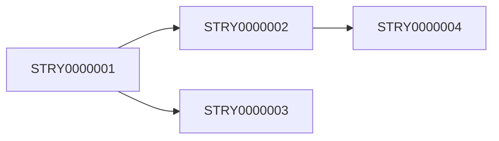

# Sprint Planning Skill

## Purpose
Facilitate sprint planning by analyzing the backlog, estimating effort, and creating balanced sprint commitments based on team capacity.

## When to Use
- Start of new sprint/iteration
- Mid-sprint re-planning
- Capacity changes (team member availability)
- Scope changes requiring re-prioritization

---

## Instructions

### 1. Read Current State
Load and analyze:
- `PLAN.md` - Current backlog and trajectory
- `docs/functional/FRD_REQUIREMENTS_INDEX.md` - Requirement Registry
- `SESSION_LOG.md` - Recent velocity data

### 2. Analyze Backlog

#### Categorize Tasks
Group backlog items by:
- **MUST** - Critical for milestone
- **SHOULD** - Important but not blocking
- **COULD** - Nice to have if capacity allows

#### Map to Personas
Identify which persona handles each task:
- Research tasks
- `/analyst` tasks
- `/architect` tasks
- `/build` tasks
- `/design` tasks
- `/test` tasks

### 3. Estimate Effort

#### Story Point Scale
| Size | Points | Typical Duration | Complexity |
|------|--------|------------------|------------|
| XS | 1 | < 2 hours | Trivial change |
| S | 2 | 2-4 hours | Simple task |
| M | 3 | 4-8 hours | Standard task |
| L | 5 | 1-2 days | Complex task |
| XL | 8 | 2-3 days | Very complex |
| XXL | 13 | 3-5 days | Should split |

#### Estimation Rules
- If effort > 8 points, recommend splitting
- Include buffer for unknowns (add 20%)
- Account for dependencies

### 4. Calculate Capacity

#### Default Capacity
```
Sprint Duration: [X days]
Team Capacity: [Y points per day]
Total Capacity: X × Y points
Buffer (20%): Subtract 20%
Available: Final capacity
```

### 5. Create Sprint Commitment

#### Selection Criteria
1. All MUST items first
2. SHOULD items by priority
3. COULD items if capacity remains
4. Balance across personas
5. Respect dependencies

### 6. Output
Update `PLAN.md` with sprint trajectory and generate sprint report.

---

## Sprint Report Template

```markdown
# 🏃 SPRINT [N] PLAN

**Sprint:** [N]
**Duration:** [Start Date] → [End Date]
**Goal:** [Sprint objective in one sentence]

---

## Capacity Planning

| Metric | Value |
|--------|-------|
| Sprint Duration | X days |
| Available Points | Y points |
| Committed Points | Z points |
| Buffer | 20% |
| Utilization | Z/Y × 100% |

---

## Sprint Commitment

### MUST (Critical)
| ID | Task | Persona | Points | Dependencies |
|----|------|---------|--------|--------------|
| STRY0000001 | [Task] | /build | 5 | None |
| STRY0000002 | [Task] | /design | 3 | STRY0000001 |

**Subtotal:** X points

### SHOULD (Important)
| ID | Task | Persona | Points | Dependencies |
|----|------|---------|--------|--------------|
| STRY0000003 | [Task] | /build | 3 | None |

**Subtotal:** X points

### COULD (If Capacity)
| ID | Task | Persona | Points | Dependencies |
|----|------|---------|--------|--------------|
| STRY0000004 | [Task] | /design | 2 | None |

**Subtotal:** X points

---

## Workload Distribution

| Persona | Points | Tasks | % of Sprint |
|---------|--------|-------|-------------|

| /analyst | X | Y | Z% |
| /architect | X | Y | Z% |
| /build | X | Y | Z% |
| /design | X | Y | Z% |
| /test | X | Y | Z% |

---

## Dependencies



---

## Risks

| Risk | Impact | Mitigation |
|------|--------|------------|
| [Dependency delay] | [Effect] | [Plan B] |

---

## Definition of Done
- [ ] All committed MUST items complete
- [ ] Tests passing for all features
- [ ] Documentation updated
- [ ] No critical bugs open

---

## Not Included (Deferred)
| ID | Task | Reason |
|----|------|--------|
| STRY0000005 | [Task] | Capacity |
| STRY0000006 | [Task] | Dependencies not ready |
```

---

## PLAN.md Update

After sprint planning, update PLAN.md:

```markdown
## 3. Current Trajectory

### Sprint [N]: [Goal]
**Period:** [Start] → [End]
**Capacity:** [X] points

| ID | Task | Persona | Points | Status |
|----|------|---------|--------|--------|
| STRY0000001 | [Task] | /build | 5 | [IN-PROGRESS] |
| STRY0000002 | [Task] | /design | 3 | [READY] |
```

---

## How to Verify
- Sprint plan created with clear goal
- Total committed points ≤ available capacity
- All MUST items included
- Dependencies mapped and sequenced
- PLAN.md updated with trajectory
